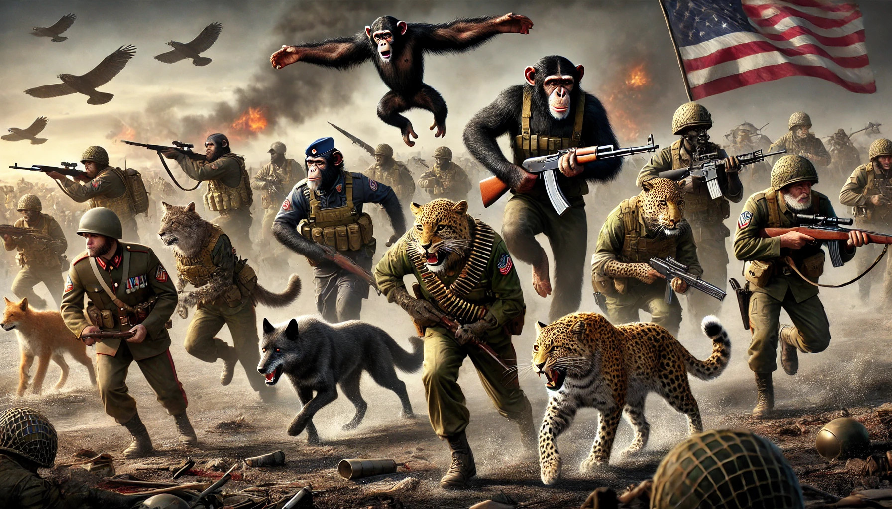

Purpose First
-------------

There have been times when people have come together, struggled through
incredible hardship, made tremendous personal sacrifice, in order to
achieve a staggering outcome.

I want to pick as an example all the nations that fought in World War
II, but I want to look at 1947 to 1952. `In Germany`_, the Allies,
including Russia, were brutal after the war. Widespread instances of
rape, systematic forced labour, and expulsions on a massive scale that
resulted in 1.5 to 2 million deaths. But then in 1947 the West
implemented the Marshall Plan, and built Germany back up. This was not
unrelated to the threat of Communism. The equivalent of hundreds of
billions of today's dollars were loaned to and invested in Germany. The
West provided a market for German products and services. Germany
reestablished its own currency. They formed a new democratic
government. Unemployment decreased. Production increased. The standard
of living increased.

A similar process of reconstruction happened `in Japan`_. Massive
political and economic reforms resulted in the dismanting of ancient
social stratifications, allowing economic mobility, and the
liberalization of society, including the enfanchisement of women. Again,
a new threat, the war in Korea, provided a market for goods and
services from Japan, and helped to rebuild the economy.

Was everything peachy? Absolutely not. But recent enemies came together,
and built something better than what had existed before. Some would
argue, better than what had existed in the countries of both the
vanquished and the victors!

The war made some people better versions of themselves. (Definitely not
everyone!) It gave people something to overcome, and to struggle for.
It united them with a common purpose.

`In Edinburgh last week`_, people pushed rocket fireworks through the
mail slots in the front doors of random strangers. They threw bottles,
bricks and fireworks at police ... because ... it's fun.

In America ... well ... we all know what happened in America. A rapist
and convicted felon, who tried to overturn the results of the previous
election, won the popular vote. I live a very sheltered live, and it's
hard for me to understand how this can happen. My guess is that it has
many causes. One cause is that many people believe him.

When Enron lied in their financial reporting, shareholders sued them for
$40,000,000,000. It's against the law to lie to shareholders. But it's
not against the law to lie to voters. In fact, since George W. Bush,
it's been explicit Republican strategy. And when you have parallel
media universes, and social media stops deleting or tagging lies, you
can invent a comprehensive fake universe, with wildly distorted
enemies, and present yourselves as struggling underdog good guys.

They invented a story that is much more powerful than reality. A story
in which the economy is terrible, in which women are murdering their
newborns, in which there is an armed invasion from the south with
sympathetic operatives who have infiltrated the whole of society. Also,
they're eating our dogs. The Republicans simply, far and away,
out-bullshitted the Democrats.

Another cause is the same reason that teenagers push rocket fireworks
through the mail slots in the front doors of random people, and throw
bottles, bricks and fireworks at police:

They need to feel part of a team. They need something that they want to
work together for, struggle for, win at.

They need to be the heroes of their own `hero narrative`_.

They need to be given a purpose.

A purpose carried by a more powerful story. Personally, I don't want
that story to be a lie. But at this point I'm open to suggestions,
because I don't know how to fight this.

.. _In Germany: https://en.wikipedia.org/wiki/Reconstruction_of_Germany
.. _in Japan: https://history.state.gov/milestones/1945-1952/japan-reconstruction
.. _In Edinburgh last week: https://www.bbc.co.uk/news/articles/cwy1v577lneo
.. _hero narrative: https://en.wikipedia.org/wiki/Hero%27s_journey
