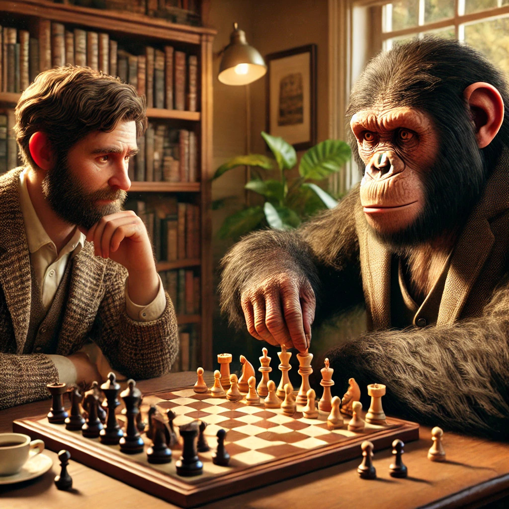

Problem-Solving
---------------

So, let's say that we've given people something to believe in. Something
we can feel that we are a part of, that we can struggle for, and
that we can win at.

It gives us a sense of purpose, and motivates us. Now what? What do we
need to do? What are the kinds of problems that we need to solve?

* Climate change is a real thing. As areas appropriate for particular
  crops shift to different areas, crops and/or people will need to
  shift, which will result in conflict and war. Climate change will
  also result in disastrous hurricanes, storms and floods. All these
  things are already happening, and will continue to get worse.

* Apart from a few very scary moments, in particular a truly terrifying
  `moment in 1962`_, nuclear weapons have been safeguarded by just two
  groups of adults. That is no longer true. Today the largest arsenal
  is controlled by a megalomaniacal tyrant who is currently invading
  Europe, and soon the second-largest arsenal will be controlled by an
  easily flattered, narcissistic man-baby. China is rapidly approaching
  from behind, with India, Pakistan and Israel also in the race, and
  new entrant North Korea, headed by a guy who executed his uncle,
  along with his uncle's children and grandchildren just to be
  thorough. These are not the people I would want controlling weapons
  that could cause the kind of nuclear winter that would kill off
  everyone except a handful of tech billionaires sheltering in bunkers
  in New Zealand.

* In 2001 a small group of people studied how to fly aeroplanes, and
  then successfully managed to fly three out of four into buildings.
  They hoped to trigger a conflict that would bring an end to Western
  society.

  In 2024 it is possible for a small group of people to study how to
  create a variation of smallpox in a lab. Covid had a death rate of
  between 1 and 2% of those infected. Smallpox has a death rate of 30%,
  and a synthetic variant could kill upwards of 90%. If the only
  survivors are children, they will soon starve.

* Some problems are a lot more personal. Things used to be uncomplicated
  for men. Right from Day 1, a baby boy was a little bit cooler than a
  baby girl. Parents loved their daughters, of course, but dads
  introduced their sons to their business connections, and taught them
  how to shake hands like a man. Moms would divide up household chores
  in such a way that girls did the inside chores, and boys did the
  outside chores, and somehow the outside chores never took as much
  time as the inside chores. Sometimes transgressions were dismissed
  with "boys will be boys," or a wink behind Mom's back.

  Boys grew up with a certain understanding of how things were, and
  certain expectations of how things will be for them.

  Except, now there are girls who have the same expectations.

  And it comes as a rude surprise for men that their expectations aren't
  exclusively for them. The best-paying jobs, or the legal right to
  make all of the decisions, now those things are available to
  everyone.

  So men can no longer trade on them. Women used to need men, and that
  is no longer true.

  Some men understand that the way to have sex, and to have happy,
  successful relationships, is not to trade access to money and
  influence for those things, but rather to be the kind of person that
  other people want to sleep with, and want to have happy, successful
  relationships with.

  Other men don't like this. Being a decent human being is complicated.
  They want their expectations back. They want to go back to the "good
  old days". They want to Make Men Great Again.

  All of us have to help men, starting when they are boys, to be the
  kind of people that other people want to sleep with, and want to have
  happy, successful relationships with, for no other reason than the
  kind of person that they are. Otherwise our society will tear itself
  in two.

Those are just examples. There are other problems, and there will be new
problems. We need to listen. We need to hear about the big problems
like climate change, and the millions of little problems, the everyday
challenges that we all face.

Designing Under The Mango Tree is all about listening directly to the
people who can share what the problems are.

How do we do that at scale?

.. _moment in 1962: https://en.wikipedia.org/wiki/Cuban_Missile_Crisis
