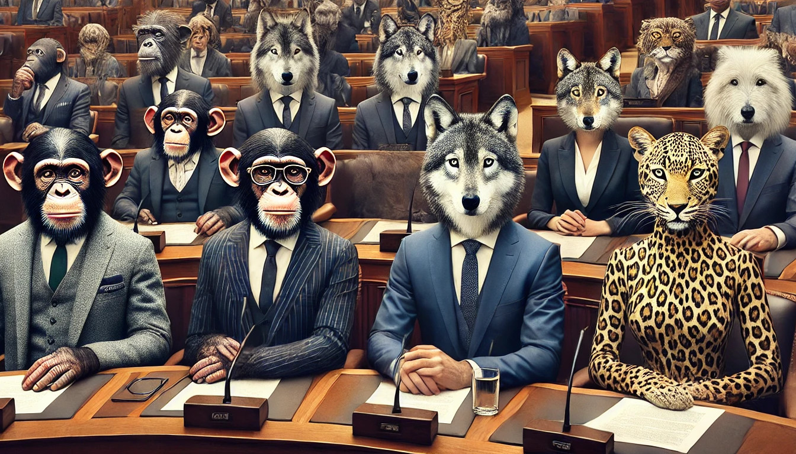

Representation
--------------

This is the part that I enjoy. This is the Mango Tree part, and the
WhatsApp-CommCare Connect part.

We can all spot bugs in the systems that we live in. But a lot of the
bugs are not bugs for everyone. For some people, they're features. And
if the bugs are features for the people who make the rules, then they
are not going to change those bugs.

In a democracy, if you don't like the people who make the rules, you can
choose different people. But what if all the people have been
pre-approved before you get to choose them. For example, in some
democracies an election campaign is very expensive. If candidates rely
on campaign contributions from rich people, then only candidates that
rich people will give money to will be available for you to choose
from. Some candidates *can* get broad financial support from people who
aren't rich, but there aren't enough of those candidates to change
things.

So then what do you do?

I think you need a new system, one that is separate from the current
system, but can co-exist, so that people can migrate to it. Kind of
like how Bluesky has been around for a little while, until the network
effect reached a tipping point, and people migrated to it from
Twitter/X.

Here is what I'm thinking: The new system is not a country. It's an app.

I haven't thought of a good name for it, so for now I'm just calling it
the **Republic of Humanity**. Again, definitely something to workshop.

It's like WhatsApp or Slack in that it has groups, but its groups work
differently. There are two kinds of groups: Interest groups, and
location groups.

You can join any interest groups you like. Your location group is
determined by the neighbourhood where you live.

All groups have a maximum of 72 people. As soon as there are more than
72 people, the group splits. And all groups are hierarchical, like
CommCare locations. Every group has two representatives that represent
it one group up.

The top-most location group is like the lower house in a parliament,
like the National Assembly in South Africa, or the House of
Representatives in the US.

The top-most interest group is like the upper house in a parliament,
like the National Council of Provinces in South Africa, or the Senate
in the US. It gives voices to groups that might not be heard in their
location. But of course unlike the Senate or the NCOP, people can
identify by something other than their province or state. An interest
group could be like a political party, or an identity, and you can
belong to multiple, because that's closer to what people are like.

The reason that groups have no more than 72 people is so that you
interact with no more than 144 people if you are a location
representative and you belong to two location groups. 144 is close to
`Dunbar's Number`_. When groups split, 72 divides up nicely in half, in
thirds, in quarters, etc.

So that is how the system listens to people at each level.

But who makes the rules for whom?

I live in Scotland. It's a country. It has its own parliament, and it
levies its own taxes. But also, it's not an independent country. It's
not allowed to join the EU, even though the majority of Scottish people
want to, and it's not allowed to establish its own currency.

So Scotland is an example of a negotiation about how much autonomy each
level of representatives should have. This is called "devolution".
Different location groups in the Republic of Humanity will need to have
the same kind of negotiation, and decide for themselves.

I also believe that everyone in the Republic of Humanity must vote for
their representatives. The consequences of compulsory voting is that it
is much more difficult for extremists to capture groups. Democracy is
not a right; it is a duty. Everyone is responsible for what the
Republic of Humanity does. If you aren't willing to take any
responsibility, then the Republic of Humanity is not for you.

That brings us to what the Republic of Humanity does. We've talked about
listening and being heard. But what do we do about it? How does the
action get done?

.. _Dunbar's Number: https://en.wikipedia.org/wiki/Dunbar's_number
